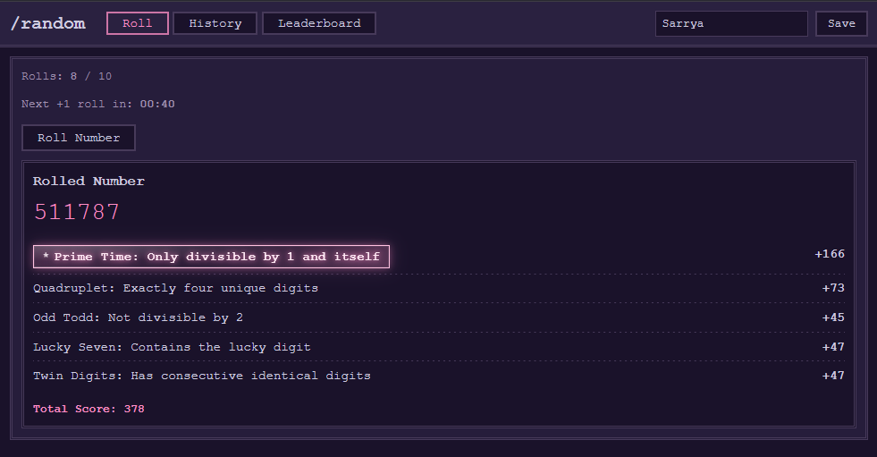

# random – A Number Game

A Go + htmx application where players roll for randomized specs and track their collection history.



### Running with Docker Compose
```bash
docker compose up --build
```

The application will start on `http://localhost:8080` once migrations complete.

## Key Features

### Roll System
- **Token Bucket Rate Limiting**: Players earn one roll every 60 seconds (configurable).
- **Quota Management**: Rolls are capped at a maximum; excess time converts to fractional quota when rolling.
- **Per-User Profiles**: Each user is identified by a profile UUID and can track their personal statistics.

### Rarity & Scoring
- **Logarithmic Rarity**: Specs are scored inversely to their probability; rarer specs yield higher scores.
- **In-Memory Cache**: Spec odds are loaded at startup and cached for fast lookup.
- **Leaderboard**: Players compete on total score and total value earned.

### Collection Tracking
- **Unlocked Specs**: History shows all specs ever rolled with per-spec counts, sorted by rarity (rarest first).
- **Persistence**: All rolls and user data stored in PostgreSQL with migration-based schema management.
